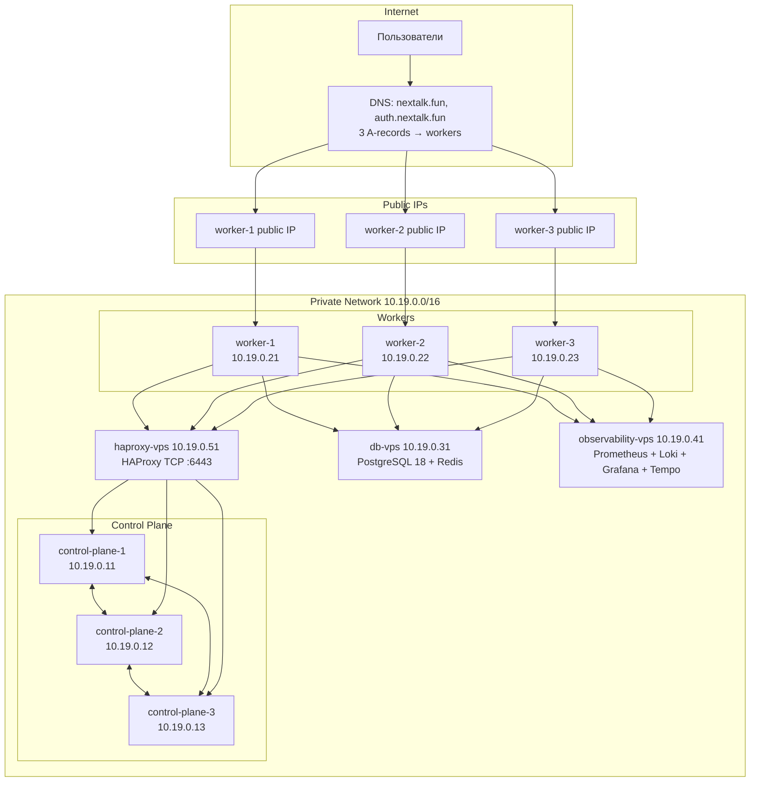

# NexTalk - Deployment

Физическая топология: какие серверы, как соединены, что где запущено, как переживает отказы.

[C4-модель](c4-model.md) описывает логическую архитектуру (сервисы и связи) и не отвечает на «сколько реплик», «где какая нода». Разные срезы, не смешиваются.

---

## Содержание

1. [Цели](#1-цели)
2. [Целевая нагрузка](#2-целевая-нагрузка)
3. [Топология](#3-топология)
4. [Инвентарь нод](#4-инвентарь-нод)
5. [HA-стратегия](#5-ha-стратегия)
6. [Сетевая модель](#6-сетевая-модель)
7. [DNS, TLS, поддомены](#7-dns-tls-поддомены)
8. [Observability](#8-observability)
9. [БД standalone](#9-бд-standalone)
10. [Ansible](#10-ansible)
11. [Узкие места](#11-узкие-места)
12. [Roadmap](#12-roadmap)
13. [Ссылки](#13-ссылки)

---

## 1. Цели

- Production HA - переживание падения любой одной control-plane / worker ноды без простоя.
- Соответствие NFR из [README §8](../README.md#8-нефункциональные-требования-nfr): 99% uptime, p95 < 150ms, 200–300 concurrent WS.
- Разделение слоев: stateless (k3s) / stateful (db-vps) / observability (observability-vps) / lb (haproxy-vps).

Выбор k3s HA на VPS: managed K8s дорого, single-node Compose не дает NFR-6, in-cluster PostgreSQL без оператора - SPOF.

---

## 2. Целевая нагрузка

Источник: [README §8 NFR](../README.md#8-нефункциональные-требования-nfr).

| Параметр                  | Значение                | NFR     |
|:--------------------------|:------------------------|:--------|
| Concurrent WS             | 200–300                 | NFR-20  |
| Пиковый RPS на ingress    | 100–150                 | -       |
| Поток сообщений           | 60 msg/sec              | -       |
| ACK p95                   | < 200 ms                | NFR-2   |
| Доставка p95              | < 500 ms                | NFR-3   |
| REST API p95              | < 150 ms                | NFR-1   |
| Uptime                    | 99% (~7 ч/мес простоя)  | NFR-6   |
| RTO                       | < 45 с                  | NFR-7   |
| PG pool                   | 20 conn/service         | NFR-22  |

Запас на железо - ~30% поверх этих чисел.

---

## 3. Топология



HAProxy проксирует k3s apiserver (TCP :6443) с health-check на каждую control-plane ноду. Между control-plane нодами - etcd Raft.

---

## 4. Инвентарь нод

Все VPS унифицированы: **2 vCPU / 4 GB RAM / 40 GB SSD**.

| Роль              | IP           | Public IP | Что внутри                                                                                              |
|:------------------|:-------------|:----------|:--------------------------------------------------------------------------------------------------------|
| haproxy-vps       | `10.19.0.51` | нет       | HAProxy TCP балансировщик для k3s apiserver (:6443), stats (:9000)                                      |
| k3s control-plane-1 | `10.19.0.11` | нет     | k3s server, embedded etcd (cluster-init)                                                                |
| k3s control-plane-2 | `10.19.0.12` | нет     | k3s server, embedded etcd                                                                               |
| k3s control-plane-3 | `10.19.0.13` | нет     | k3s server, embedded etcd                                                                               |
| k3s worker-1      | `10.19.0.21` | да        | ingress-nginx (DaemonSet/hostNetwork), guild/messaging/voice/ws, zitadel, prometheus-forwarder, alloy   |
| k3s worker-2      | `10.19.0.22` | да        | то же                                                                                                   |
| k3s worker-3      | `10.19.0.23` | да        | то же                                                                                                   |
| db-vps            | `10.19.0.31` | нет       | PostgreSQL 18 (3 БД: guild, messaging, zitadel), Redis, node_exporter                                   |
| observability-vps | `10.19.0.41` | опц.      | docker-compose: Prometheus, Loki, Tempo, Grafana                                                        |

**Итого:** 9 VPS, 18 vCPU, 36 GB RAM, 360 GB SSD, 3 публичных IP.

---

## 5. HA-стратегия

### 5.1 etcd и quorum

k3s HA использует [embedded etcd](https://docs.k3s.io/datastore/ha-embedded) - распределенная key-value БД с консенсусом Raft.

| Control-plane | Quorum | Переживает падений |
|:--------------|:-------|:-------------------|
| 1             | 1      | 0 (нет HA)         |
| 2             | 2      | 0                  |
| **3**         | **2**  | **1**              |
| 5             | 3      | 2                  |

Берем 3 - минимум для HA. Четные числа не дают выигрыша, увеличивают risk split-brain.

### 5.2 HAProxy - балансировщик для apiserver

Все ноды и `kubectl` обращаются к `https://10.19.0.51:6443` (haproxy-vps). HAProxy делает TCP health-check на все три control-plane ноды (`check inter 5s rise 2 fall 3`) и автоматически исключает упавший узел из ротации.

kube-vip ARP mode не применяется: Beget hypervisor фильтрует gratuitous ARP для IP-адресов, не назначенных VM при создании. Подробнее - [decisions.md](decisions.md).

### 5.3 Failover-сценарии

| Сценарий           | Влияние                                                                            | Восстановление                          |
|:-------------------|:-----------------------------------------------------------------------------------|:----------------------------------------|
| 1 control-plane    | HAProxy перестает слать трафик на упавший узел (~10 сек), кластер работает        | Авто после возврата                     |
| 2 control-plane    | etcd теряет quorum, read-only. Существующие поды работают, новых не создать.      | Поднять любой → quorum                  |
| haproxy-vps        | kubectl и регистрация новых нод недоступны. Работающие поды и трафик - без изменений | Поднять haproxy-vps (fast restore)   |
| 1 worker           | Поды пересоздаются на остальных, 1/3 пользователей переподключаются через DNS      | Авто; DNS-failover 30–60 сек            |
| 2 worker           | Поды на 1 ноде → resource pressure, часть в Pending                                | Поднять воркер                          |
| db-vps             | **Полная остановка приложения**                                                    | Бэкап + restore                         |
| observability-vps  | Приложение работает, теряем метрики/логи                                           | Поднять observability → буфер дофорвардится |

---

## 6. Сетевая модель

### 6.1 Подсети

| Сеть          | CIDR             | Назначение                |
|:--------------|:-----------------|:--------------------------|
| Private Beget | `10.19.0.0/16`   | межнодовый трафик         |
| Pod (k3s)     | `10.42.0.0/16`   | поды                      |
| Service (k3s) | `10.43.0.0/16`   | ClusterIP                 |

### 6.2 IP-план

| Хост               | Private IP    | Public IP    |
|:-------------------|:--------------|:-------------|
| haproxy-vps        | `10.19.0.51`  | -            |
| control-plane-1    | `10.19.0.11`  | -            |
| control-plane-2    | `10.19.0.12`  | -            |
| control-plane-3    | `10.19.0.13`  | -            |
| worker-1           | `10.19.0.21`  | статический  |
| worker-2           | `10.19.0.22`  | статический  |
| worker-3           | `10.19.0.23`  | статический  |
| db-vps             | `10.19.0.31`  | -            |
| observability-vps  | `10.19.0.41`  | опц. (Grafana) |

### 6.3 Firewall (ufw)

| Хост          | Allow from           | Порты                                                              |
|:--------------|:---------------------|:-------------------------------------------------------------------|
| haproxy-vps   | `10.19.0.0/16`       | 6443 (apiserver proxy), 9000 (stats)                               |
| control-plane | `10.19.0.0/16`       | 6443 (apiserver), 2379-2380 (etcd), 10250, 8472/udp (flannel)      |
| worker        | `10.19.0.0/16`       | 10250, 8472/udp                                                    |
| worker        | `0.0.0.0/0`          | 80, 443 (ingress)                                                  |
| db-vps        | `10.19.0.21-23`      | 5432, 6379                                                         |
| observability-vps | `10.19.0.0/16`   | 4317, 4318 (OTLP), 3100 (Loki), 9090 (PG remote_write)             |
| observability-vps | `0.0.0.0/0` (опц.) | 443 (Grafana)                                                    |
| все           | `0.0.0.0/0`          | 22 (SSH)                                                           |

---

## 7. DNS, TLS, поддомены

### 7.1 Поддомены

| Поддомен               | Назначение                          | Статус        |
|:-----------------------|:------------------------------------|:--------------|
| `nextalk.fun`          | React SPA + REST + WebSocket        | core          |
| `auth.nextalk.fun`     | Zitadel (OIDC)                      | обязательно   |
| `grafana.nextalk.fun`  | Grafana                             | опционально   |
| `livekit.nextalk.fun`  | LiveKit signaling/SFU               | не делаем     |

### 7.2 DNS-записи

```dns
nextalk.fun.            A    <public-IP-worker-1>
nextalk.fun.            A    <public-IP-worker-2>
nextalk.fun.            A    <public-IP-worker-3>

auth.nextalk.fun.       A    <public-IP-worker-1>
auth.nextalk.fun.       A    <public-IP-worker-2>
auth.nextalk.fun.       A    <public-IP-worker-3>

grafana.nextalk.fun.    A    <public-IP-worker-1>
```

DNS round-robin. При падении воркера 1/3 пользователей попадают в timeout → retry на живой. Floating IP в Beget не поддерживается, failover через DNS (30–60 сек).

### 7.3 TLS - cert-manager + Let's Encrypt

- [cert-manager](https://cert-manager.io/docs/installation/helm/) в k3s
- Два ClusterIssuer: staging (для отладки) и prod
- HTTP-01 challenge через ingress-nginx
- Автоматическое продление

### 7.4 ingress-nginx, не Traefik

`--disable traefik` при установке k3s. ingress-nginx как DaemonSet с `hostNetwork: true` (слушает 80/443 напрямую на публичном IP воркера).

---

## 8. Observability

### 8.1 Почему отдельный слой

При падении k3s теряем мониторинг тогда, когда он нужен. Метрики/логи - write-heavy с retention, не соседствуют со stateless нагрузкой.

### 8.2 Поток данных

```
┌─────────────────────────────────────────────┐         ┌──────────────────────────┐
│         k3s cluster (workers)               │         │      observability-vps   │
│                                             │         │                          │
│  ┌─────────┐    ┌────────────┐              │ remote  │  ┌────────────────────┐  │
│  │ apps    │───▶│ Prometheus │──────────────┼─write──▶│  │ Prometheus 30d     │  │
│  │ /metrics│    │ 1d retain  │              │         │  └────────────────────┘  │
│  └─────────┘    └────────────┘              │         │                          │
│                                             │  push   │  ┌────────────────────┐  │
│  ┌─────────┐    ┌────────────┐              ├────────▶│  │ Loki               │  │
│  │ stdout  │───▶│ Alloy DS   │              │         │  └────────────────────┘  │
│  └─────────┘    └────────────┘              │         │                          │
│                                             │  OTLP   │  ┌────────────────────┐  │
│  ┌─────────┐                                ├─gRPC───▶│  │ Tempo (OTLP :4317) │  │
│  │ traces  │                                │         │  └────────────────────┘  │
│  └─────────┘                                │         │                          │
│                                             │         │  ┌────────────────────┐  │
└─────────────────────────────────────────────┘         │  │ Grafana            │  │
                                                        │  └────────────────────┘  │
                                                        └──────────────────────────┘
```

### 8.3 Стек на observability-vps

docker-compose: Prometheus, Loki, Tempo (OTLP :4317/4318), Grafana.

Retention под 40 GB диск:
- **Prometheus** - 15 дней
- **Loki** - 30 дней
- **Tempo** - 3 дня

---

## 9. БД standalone

### 9.1 Почему не в кластере

| Вариант                          | Минусы                                                                                  |
|:---------------------------------|:----------------------------------------------------------------------------------------|
| StatefulSet PG (1 реплика)       | Под падает → переплан → 30+ сек downtime, риск повреждения                              |
| StatefulSet + Patroni/Stolon     | Operator overhead, сложный rollback при обновлении PG                                   |
| **Standalone PG на отдельной VPS** | Простота, изоляция аварий, простые бэкапы                                              |

### 9.2 PostgreSQL 18

- 3 БД: `guild`, `messaging`, `zitadel`
- Bind на private IP `10.19.0.31` + `pg_hba.conf` whitelisting worker'ов
- Connection pool через Npgsql, `MaxPoolSize=20`

### 9.3 Redis

- Standalone, bind на private IP + `requirepass`
- `db=0` - LiveKit (room registry, participant tracking)
- `db=2` - SignalR backplane (WS Gateway)
- `db=3` - Voice SessionStore (сессии пользователей в голосовых каналах, TTL 8h)

> Guild Service кеширует Zitadel UserInfo в `IMemoryCache` (in-memory, per-pod), не в Redis.

### 9.4 Бэкапы

`pg_dump --format=custom` через cron 1 раз в сутки, копия на observability-vps, retention 7d + 4w.

---

## 10. Ansible

### Playbook'и

| Playbook              | Цель                                                                   | Хосты                   |
|:----------------------|:-----------------------------------------------------------------------|:------------------------|
| `site.yml`            | все вместе в правильном порядке (оркестратор)                          | все                     |
| `bootstrap.yml`       | sysctl, swapoff, ufw, NTP, базовые пакеты                              | все 9                   |
| `gre-nat.yml`         | GRE-туннели + NAT: obs-vps и db-vps выходят в интернет через worker-1  | worker-1, obs-vps, db-vps |
| `haproxy.yml`         | HAProxy TCP балансировщик для apiserver (:6443)                        | haproxy-vps             |
| `db.yml`              | PostgreSQL 18 + Redis                                                  | db-vps                  |
| `observability.yml`   | docker-compose: Prometheus + Loki + Tempo + Grafana                    | observability-vps       |
| `k3s.yml`             | k3s HA install (cp + workers через HAProxy)                            | control-plane + workers |
| `cluster-addons.yml`  | ingress-nginx (DaemonSet) + metrics-server + CoreDNS fix + cert-manager | localhost (kubectl)    |
| `helm-deploy.yml`     | `helm upgrade --install nextalk ./charts/nextalk`                      | localhost (kubectl)     |

### Inventory

```ini
[control_plane]
control-plane-1 ansible_host=10.19.0.11
control-plane-2 ansible_host=10.19.0.12
control-plane-3 ansible_host=10.19.0.13

[workers]
worker-1 ansible_host=10.19.0.21 public_ip=<WORKER1_PUBLIC_IP>
worker-2 ansible_host=10.19.0.22 public_ip=<WORKER2_PUBLIC_IP>
worker-3 ansible_host=10.19.0.23 public_ip=<WORKER3_PUBLIC_IP>

[db]
db-vps ansible_host=10.19.0.31

[observability]
observability-vps ansible_host=10.19.0.41

[haproxy]
haproxy-vps ansible_host=10.19.0.51

[k3s_cluster:children]
control_plane
workers
```

SSH через bastion (worker-1), ProxyJump в `group_vars/all.yml`.

---

## 11. Узкие места

### 11.1 WebSocket Gateway - non-trivial scaling

SignalR требует sticky sessions. HPA работает, но при большом числе чатов Redis pub/sub backplane фанаутит сообщения во все узлы с участниками.

### 11.2 PostgreSQL - SPOF

Standalone PG = единая точка отказа. Митигация: бэкапы + runbook. Следующая ступень - streaming replica с ручным failover.

### 11.3 Redis - SPOF

При падении: SignalR backplane недоступен (WS Gateway не может broadcast между подами), голосовые сессии теряются (Voice SessionStore), Guild cache пустеет (регенерируется автоматически при следующем запросе). Требуется `kubectl rollout restart deployment/websocket-gateway`.

### 11.4 HAProxy - SPOF для управления кластером

haproxy-vps - единственная точка входа для kubectl и регистрации нод. При падении: работающие поды и трафик продолжают работать, но kubectl и новые деплои недоступны. Митигация: быстрое восстановление через Ansible (`ansible-playbook haproxy.yml`). Полная HA потребует keepalived/VRRP - не тестировали на Beget.

### 11.5 In-memory state в WS Gateway / Voice Service

`PresenceTracker` и `SessionStore` теряются при рестарте пода. Sticky sessions покрывают штатную работу, но не failover.

### 11.6 Outbox polling latency

OutboxWorker polling 100 мс - нижняя граница NFR-3. При росте - LISTEN/NOTIFY или event-bus.

### 11.7 Ingress - внешний failover

Beget не дает floating public IP. Внешний HA через 3 A-records DNS round-robin, failover 30–60 сек.

### 11.8 Observability VPS - single instance

При падении теряем мониторинг. Prometheus буферизует remote_write в WAL короткое время.

### 11.9 Нет cluster autoscaler

3 воркера фиксированного размера. Если HPA выкручивает реплики до потолка - поды в `Pending`.

### 11.10 Disk pressure на db-vps

40 GB на PostgreSQL + Redis. При 60 msg/sec ≈ 1 GB/день. Нужен алерт на `disk_free < 20%`.

### 11.11 Достижимость k3s API с CI-runner

Kubeconfig указывает на `10.19.0.51` (приватная Beget-сеть) - runner из интернета не достучится. Варианты: SSH-tunnel через bastion, self-hosted runner внутри Beget, делегировать helm-task через ProxyJump.

---

## 12. Roadmap

### Блок 1 - Подготовка инфраструктуры

1.1. Заказать 9 VPS `2vCPU/4GB/40GB SSD` (Ubuntu 22.04+)
1.2. Подключить к приватной сети `10.19.0.0/16`
1.3. Назначить статические приватные IP по [§6.2](#62-ip-план)
1.4. Назначить публичные IP трем worker'ам
1.5. Сгенерировать SSH-ключ для Ansible, разложить на все 9 хостов
1.6. Назначить bastion (worker-1) - единственный SSH-вход из интернета

### Блок 2 - Ansible bootstrap

2.1. `bootstrap.yml` - sysctl, swapoff, ufw, NTP, пакеты на всех 9 нодах
2.2. `haproxy.yml` - HAProxy на haproxy-vps

### Блок 3 - Database VPS

3.1. PostgreSQL 18 + Redis через `db.yml`
3.2. Проверить с воркера: `psql -h 10.19.0.31`, `redis-cli -h 10.19.0.31`

### Блок 4 - k3s HA control-plane

4.1. `ansible-playbook k3s.yml`
4.2. cp-1 устанавливается с `cluster-init`, cp-2/cp-3 джойнятся через HAProxy
4.3. `kubectl get nodes` - 3 ноды `control-plane,etcd`
4.4. kubeconfig сохраняется в `infra/kubeconfig` с server=`https://10.19.0.51:6443`
4.5. **Демо failover**: выключить cp-1, повторить `kubectl get nodes` - должно работать через cp-2/cp-3

### Блок 5 - k3s workers

5.1. Workers джойнятся через HAProxy в том же `k3s.yml`
5.2. `kubectl get nodes` - 6 нод
5.3. ingress-nginx через Helm
5.4. **Демо failover**: выключить worker-1, `kubectl get pods -n nextalk` - поды переехали

### Блок 6 - DNS и TLS

6.1. DNS A-records по [§7.2](#72-dns-записи)
6.2. cert-manager через Helm, ClusterIssuer prod

### Блок 7 - Observability VPS

7.1. `observability.yml`
7.2. Проверить Grafana через SSH-tunnel

### Блок 8 - Деплой приложения

8.1. Обновить `values.yaml`: `domain`, `authDomain`, `db.host`, `tls.enabled=true`
8.2. `helm upgrade --install nextalk ./charts/nextalk`

---

## 13. Ссылки

### k3s
- [Requirements / hardware sizing](https://docs.k3s.io/installation/requirements)
- [HA with embedded etcd](https://docs.k3s.io/datastore/ha-embedded)
- [Cluster Load Balancer](https://docs.k3s.io/datastore/cluster-loadbalancer)
- [Server configuration](https://docs.k3s.io/installation/configuration)

### HAProxy
- [HAProxy Documentation](https://www.haproxy.org/#docs)
- [TCP mode](https://docs.haproxy.org/2.8/configuration.html#4-mode)

### cert-manager / Let's Encrypt
- [Installation (Helm)](https://cert-manager.io/docs/installation/helm/)
- [ACME / Let's Encrypt](https://cert-manager.io/docs/configuration/acme/)

### ingress-nginx
- [Documentation](https://kubernetes.github.io/ingress-nginx/)
- [Sticky sessions](https://kubernetes.github.io/ingress-nginx/examples/affinity/cookie/)

### Zitadel
- [Self-hosting](https://zitadel.com/docs/self-hosting/manage/configure/)

### PostgreSQL 18
- [Docs](https://www.postgresql.org/docs/18/)

### Архитектурные
- [«Messenger System Design is Wrong»](https://andreyka26.com/messenger-system-design-is-wrong)
- [Kubernetes HorizontalPodAutoscaler](https://kubernetes.io/docs/tasks/run-application/horizontal-pod-autoscale/)

### Внутреннее
- [c4-model.md](c4-model.md)
- [decisions.md](decisions.md)
- [charts/nextalk/](../charts/nextalk/)
