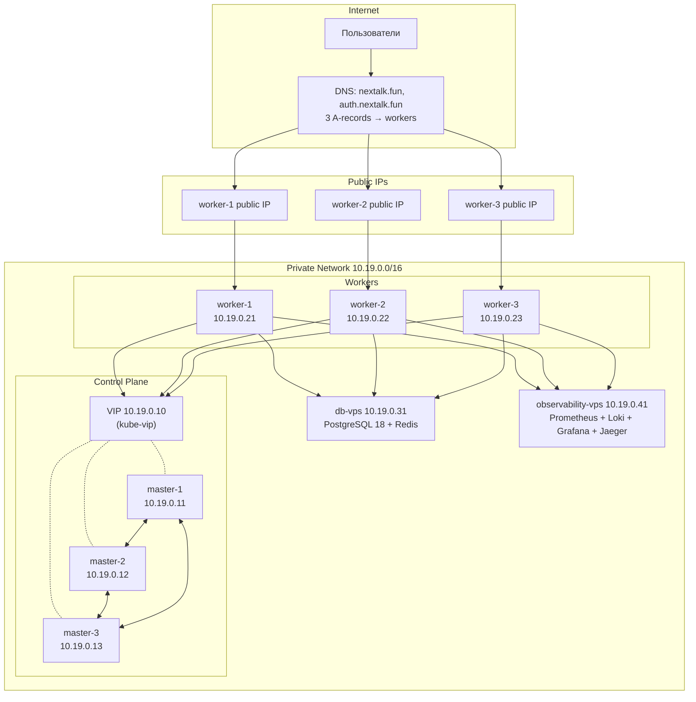

# NexTalk — Deployment

Физическая топология: какие серверы, как соединены, что где запущено, как переживает отказы.

[C4-модель](c4-model.md) описывает логическую архитектуру (сервисы и связи) и не отвечает на «сколько реплик», «где какая нода». Разные срезы, не смешиваются.

---

## Содержание

1. [Цели](#1-цели)
2. [Целевая нагрузка](#2-целевая-нагрузка)
3. [Топология](#3-топология)
4. [Инвентарь нод](#4-инвентарь-нод)
5. [HA-стратегия](#5-ha-стратегия)
6. [Сетевая модель](#6-сетевая-модель)
7. [DNS, TLS, поддомены](#7-dns-tls-поддомены)
8. [Observability](#8-observability)
9. [БД standalone](#9-бд-standalone)
10. [Ansible](#10-ansible)
11. [Узкие места](#11-узкие-места)
12. [Roadmap](#12-roadmap)
13. [Ссылки](#13-ссылки)

---

## 1. Цели

- Production HA — переживание падения любой одной control-plane / worker ноды без простоя.
- Соответствие NFR из [README §8](../README.md#8-нефункциональные-требования-nfr): 99% uptime, p95 < 150ms, 200–300 concurrent WS.
- Разделение слоёв: stateless (k3s) / stateful (db-vps) / observability (observability-vps).

Выбор k3s HA на VPS: managed K8s дорого, single-node Compose не даёт NFR-6, in-cluster PostgreSQL без оператора — SPOF.

---

## 2. Целевая нагрузка

Источник: [README §8 NFR](../README.md#8-нефункциональные-требования-nfr).

| Параметр                  | Значение                | NFR     |
|:--------------------------|:------------------------|:--------|
| Concurrent WS             | 200–300                 | NFR-20  |
| Пиковый RPS на ingress    | 100–150                 | —       |
| Поток сообщений           | 60 msg/sec              | —       |
| ACK p95                   | < 200 ms                | NFR-2   |
| Доставка p95              | < 500 ms                | NFR-3   |
| REST API p95              | < 150 ms                | NFR-1   |
| Uptime                    | 99% (~7 ч/мес простоя)  | NFR-6   |
| RTO                       | < 45 с                  | NFR-7   |
| PG pool                   | 20 conn/service         | NFR-22  |

Запас на железо — ~30% поверх этих чисел. Архитектура (in-memory presence, polling outbox 100мс, single PG) выше этого профиля упрётся раньше железа — см. [§11](#11-узкие-места).

---

## 3. Топология



Пунктир VIP ↔ master = VIP держит один master в каждый момент, через ARP перехватывает другой при failover. Между master'ами — etcd Raft.

---

## 4. Инвентарь нод

Все 8 VPS унифицированы: **2 vCPU / 4 GB RAM / 40 GB SSD**.

| Роль        | Кол-во | Public IP | Что внутри                                                                                              |
|:------------|:-------|:----------|:--------------------------------------------------------------------------------------------------------|
| k3s master  | 3      | нет       | k3s server, embedded etcd, kube-vip (DaemonSet)                                                         |
| k3s worker  | 3      | да        | ingress-nginx (DaemonSet/hostNetwork), guild/messaging/voice/ws, zitadel, prometheus-forwarder, alloy   |
| db-vps      | 1      | нет       | PostgreSQL 18 (3 БД: guild, messaging, zitadel), Redis, node_exporter                                   |
| observability-vps     | 1      | опц.      | docker-compose: Prometheus, Loki, Jaeger, Grafana, OTel Collector, Alloy                                |

**Итого:** 8 VPS, 16 vCPU, 32 GB RAM, 320 GB SSD, 3 публичных IP.

Обоснование:
- **2/4 GB на master** — [docs.k3s.io Sizing Guide](https://docs.k3s.io/installation/requirements): `2 vCPU / 4 GB → до 350 agent-нод`. Меньше — риск нестабильного etcd.
- **2/4 GB на worker** — steady state ~4 CPU/4 GB на кластер. Пик HPA упрётся в потолок раньше железа — приемлемо под NFR-20.
- **40 GB на db-vps** — узко. При 60 msg/sec пик ≈ 1 GB/день, реалистично ~0.2 GB/день. На MVP хватит на месяцы, но disk-monitoring обязателен. См. [§11.9](#119-disk-pressure-на-db-vps).
- **40 GB на observability-vps** — требует агрессивного retention. См. [§8.3](#83-стек-на-observability-vps) и [§11.10](#1110-disk-pressure-на-observability-vps).

---

## 5. HA-стратегия

### 5.1 etcd и quorum

k3s HA использует [embedded etcd](https://docs.k3s.io/datastore/ha-embedded) — распределённая key-value БД с консенсусом Raft. Запись подтверждается большинством нод.

| Master | Quorum | Переживает падений |
|:-------|:-------|:-------------------|
| 1      | 1      | 0 (нет HA)         |
| 2      | 2      | 0                  |
| **3**  | **2**  | **1**              |
| 5      | 3      | 2                  |

Берём 3 — минимум для HA. Чётные числа не дают выигрыша, увеличивают risk split-brain.

### 5.2 kube-vip — VIP для apiserver

worker'ы и `kubectl` обращаются к `https://10.19.0.10:6443` (VIP). [kube-vip](https://kube-vip.io/docs/usage/k3s/) — static pod на каждом master'е, держит VIP и переключает за 3–5 сек при падении master'а.

Альтернатива (HAProxy/keepalived на отдельных VPS) — тот же VRRP-механизм, но платим за лишние серверы. DNS round-robin не подходит — медленный failover.

### 5.3 Failover-сценарии

| Сценарий           | Влияние                                                                            | Восстановление                          |
|:-------------------|:-----------------------------------------------------------------------------------|:----------------------------------------|
| 1 master           | VIP перехвачен за 5 сек, кластер работает                                          | Авто после возврата                     |
| 2 master           | etcd теряет quorum, read-only. Существующие поды работают, новых не создать.      | Поднять любой → quorum                  |
| 1 worker           | HPA пересоздаёт поды, 1/3 пользователей переподключаются через DNS                | Авто; DNS-failover 30–60 сек            |
| 2 worker           | Поды на 1 ноде → resource pressure, часть в Pending                                | Поднять воркер; cluster autoscaling нет |
| db-vps             | **Полная остановка приложения**                                                    | См. [§11.2](#112-postgresql--spof)      |
| observability-vps            | Приложение работает, теряем метрики/логи. k3s Prometheus буферизует WAL.          | Поднять observability → буфер дофорвардится       |

---

## 6. Сетевая модель

### 6.1 Подсети

| Сеть          | CIDR             | Назначение                |
|:--------------|:-----------------|:--------------------------|
| Private Beget | `10.19.0.0/16`   | межнодовый трафик         |
| Pod (k3s)     | `10.42.0.0/16`   | поды                      |
| Service (k3s) | `10.43.0.0/16`   | ClusterIP                 |

### 6.2 IP-план

| Хост       | Private IP    | Public IP    |
|:-----------|:--------------|:-------------|
| VIP        | `10.19.0.10`  | —            |
| master-1   | `10.19.0.11`  | —            |
| master-2   | `10.19.0.12`  | —            |
| master-3   | `10.19.0.13`  | —            |
| worker-1   | `10.19.0.21`  | статический  |
| worker-2   | `10.19.0.22`  | статический  |
| worker-3   | `10.19.0.23`  | статический  |
| db-vps     | `10.19.0.31`  | —            |
| observability-vps    | `10.19.0.41`  | опц. (Grafana) |

### 6.3 Firewall (ufw)

| Хост    | Allow from           | Порты                                                              |
|:--------|:---------------------|:-------------------------------------------------------------------|
| master  | `10.19.0.0/16`       | 6443 (apiserver), 2379-2380 (etcd), 10250, 8472/udp (flannel)      |
| worker  | `10.19.0.0/16`       | 10250, 8472/udp                                                    |
| worker  | `0.0.0.0/0`          | 80, 443 (ingress)                                                  |
| db-vps  | `10.19.0.21-23`      | 5432, 6379                                                         |
| observability-vps | `10.19.0.0/16`       | 4317, 4318 (OTLP), 3100 (Loki), 9090 (PG remote_write)             |
| observability-vps | `0.0.0.0/0` (опц.)   | 443 (Grafana)                                                      |
| все     | админ IP             | 22 (SSH)                                                           |

Наружу только 80/443 на workers и опц. 443 на observability для Grafana. Управление и межсервисный трафик — внутри приватной сети.

---

## 7. DNS, TLS, поддомены

### 7.1 Поддомены

| Поддомен               | Назначение                          | Статус        |
|:-----------------------|:------------------------------------|:--------------|
| `nextalk.fun`          | React SPA + REST + WebSocket        | core          |
| `auth.nextalk.fun`     | Zitadel (OIDC)                      | обязательно   |
| `grafana.nextalk.fun`  | Grafana                             | опционально   |
| `livekit.nextalk.fun`  | LiveKit signaling/SFU               | не делаем     |

REST API и WebSocket держим на корневом домене — фронту удобнее на одном origin (нет CORS, нет cross-site cookies). LiveKit идёт через `/livekit/` на основном домене.

Добавление поддомена в будущем = DNS A-record + ingress rule + Certificate ресурс. Перезапусков нет.

### 7.2 DNS-записи

```dns
nextalk.fun.            A    <public-IP-worker-1>
nextalk.fun.            A    <public-IP-worker-2>
nextalk.fun.            A    <public-IP-worker-3>

auth.nextalk.fun.       A    <public-IP-worker-1>
auth.nextalk.fun.       A    <public-IP-worker-2>
auth.nextalk.fun.       A    <public-IP-worker-3>

grafana.nextalk.fun.    A    <public-IP-worker-1>
```

DNS round-robin. Браузер выбирает IP. При падении воркера 1/3 пользователей попадают в timeout → retry на живой. Floating IP в Beget между VPS не поддерживается, поэтому failover внешнего трафика — через DNS (30–60 сек). См. [§11.6](#116-ingress--внешний-failover).

### 7.3 TLS — cert-manager + Let's Encrypt

- [cert-manager](https://cert-manager.io/docs/installation/helm/) в k3s
- Два [ClusterIssuer](../charts/nextalk/templates/clusterissuer.yaml): staging (для отладки) и prod
- HTTP-01 challenge через ingress-nginx
- Автоматическое продление

Один issuer выпускает по сертификату на каждый поддомен (`nextalk-tls`, `auth-nextalk-tls`, `grafana-nextalk-tls`).

Zitadel: TLS-termination на ingress (`ZITADEL_TLS_ENABLED: false`, `ZITADEL_EXTERNALSECURE: true`, `ZITADEL_EXTERNALDOMAIN: auth.nextalk.fun`). Discovery URL: `https://auth.nextalk.fun/.well-known/openid-configuration`.

### 7.4 ingress-nginx, не Traefik

При установке k3s передаём `--disable traefik`, ставим [ingress-nginx](https://kubernetes.github.io/ingress-nginx/) как DaemonSet с `hostNetwork: true` (слушает 80/443 напрямую на публичном IP воркера, без прослойки klipper).

nginx выбран за объём документации и community, особенно по WebSocket/sticky-sessions. Traefik умеет то же, но в проекте опыта меньше.

---

## 8. Observability

### 8.1 Почему отдельный слой

При падении k3s теряем мониторинг тогда, когда он нужен. Метрики/логи — write-heavy с retention, не соседствуют со stateless нагрузкой.

### 8.2 Поток данных

```
┌─────────────────────────────────────────────┐         ┌──────────────────────────┐
│         k3s cluster (workers)               │         │      observability-vps             │
│                                             │         │                          │
│  ┌─────────┐    ┌────────────┐              │ remote  │  ┌────────────────────┐  │
│  │ apps    │───▶│ Prometheus │──────────────┼─write──▶│  │ Prometheus 30d     │  │
│  │ /metrics│    │ 1d retain  │              │         │  └────────────────────┘  │
│  └─────────┘    └────────────┘              │         │                          │
│                                             │  push   │  ┌────────────────────┐  │
│  ┌─────────┐    ┌────────────┐              ├────────▶│  │ Loki               │  │
│  │ stdout  │───▶│ Alloy DS   │              │         │  └────────────────────┘  │
│  └─────────┘    └────────────┘              │         │                          │
│                                             │  OTLP   │  ┌────────────────────┐  │
│  ┌─────────┐                                ├─gRPC───▶│  │ OTel → Tempo/Jaeger│  │
│  │ traces  │                                │         │  └────────────────────┘  │
│  └─────────┘                                │         │                          │
│                                             │         │  ┌────────────────────┐  │
└─────────────────────────────────────────────┘         │  │ Grafana            │  │
                                                        │  └────────────────────┘  │
                                                        └──────────────────────────┘
```

- **Метрики:** k3s Prometheus (retention 1d) → `remote_write` → observability-vps Prometheus (`--web.enable-remote-write-receiver`).
- **Логи:** Grafana Alloy как DaemonSet ([alloy-k8s.alloy](../charts/nextalk/files/alloy-k8s.alloy)) читает pod logs через k8s API → Loki.
- **Трейсы:** OTLP gRPC напрямую на observability-vps:4317.

### 8.3 Стек на observability-vps

`docker-compose.observability.yaml` (см. [infra/observability/](../infra/observability/)): Prometheus, Loki, Tempo (или Jaeger), OTel Collector, Grafana с провизионированными [datasources](../infra/observability/grafana/provisioning/datasources/datasources.yaml).

Retention под 40 GB диск:
- **Prometheus** — 7 дней (`--storage.tsdb.retention.time=7d`)
- **Loki** — 7 дней (`limits_config.retention_period: 168h` + compactor)
- **Tempo** — 3 дня

При росте — увеличить диск VPS или вынести в S3-совместимое хранилище.

---

## 9. БД standalone

### 9.1 Почему не в кластере

| Вариант                          | Минусы                                                                                  |
|:---------------------------------|:----------------------------------------------------------------------------------------|
| StatefulSet PG (1 реплика)       | Под падает → переплан → 30+ сек downtime, риск повреждения                              |
| StatefulSet + Patroni/Stolon     | Operator overhead, сложный rollback при обновлении PG                                   |
| **Standalone PG на отдельной VPS** | Простота, изоляция аварий, простые бэкапы                                              |

Standalone — не HA, но в нашем масштабе trade-off оправдан. Восстановление при падении = новый VPS + restore из бэкапа.

### 9.2 PostgreSQL 18

- 3 БД на одной инстансе: `guild`, `messaging`, `zitadel` (database-per-service паттерн)
- Bind на private IP `10.19.0.31` + `pg_hba.conf` whitelisting worker'ов
- Connection pool через Npgsql, `MaxPoolSize=20` (NFR-22)

Репликация — следующая ступень HA (streaming replica + ручной failover), сейчас не делаем. Шардирование под наш профиль (60 msg/sec) не нужно.

### 9.3 Redis

- Standalone (Sentinel/Cluster — overhead под наш масштаб)
- Bind на private IP + `requirepass`
- Логические БД:
  - `db=0` — Guild Service cache (Zitadel UserInfo)
  - `db=1` — общий кэш
  - `db=2` — SignalR backplane для WS Gateway

### 9.4 Бэкапы

Минимум: `pg_dump --format=custom` через cron 1 раз в сутки, копия на observability-vps по rsync, retention 7d + 4w.

Серьёзнее (если время): WAL archiving + `pg_basebackup` для PITR + внешнее S3-хранилище.

---

## 10. Ansible

За основу — официальный [k3s-io/k3s-ansible](https://github.com/k3s-io/k3s-ansible), поддерживает HA через kube-vip из коробки.

### Playbook'и

| Playbook              | Цель                                                    | Хосты              |
|:----------------------|:--------------------------------------------------------|:-------------------|
| `bootstrap.yml`       | sysctl, swapoff, ufw, NTP, базовые пакеты               | все 8              |
| `k3s-cluster.yml`     | k3s HA install + kube-vip                               | master + worker    |
| `db.yml`              | PostgreSQL 18 + Redis + конфиги                         | db-vps             |
| `observability.yml`             | docker + compose stack                                  | observability-vps            |
| `helm-deploy.yml`     | `helm upgrade --install nextalk ./charts/nextalk`       | первый master      |
| `backup.yml` (опц.)   | cron pg_dump                                            | db-vps             |

### Inventory

```ini
[masters]
master-1 ansible_host=10.19.0.11
master-2 ansible_host=10.19.0.12
master-3 ansible_host=10.19.0.13

[workers]
worker-1 ansible_host=10.19.0.21
worker-2 ansible_host=10.19.0.22
worker-3 ansible_host=10.19.0.23

[db]
db-vps ansible_host=10.19.0.31

[observability]
observability-vps ansible_host=10.19.0.41

[k3s_cluster:children]
masters
workers
```

SSH через bastion (worker с публичным IP), ProxyJump в `ansible.cfg`.

---

## 11. Узкие места

Места с потолком или SPOF. Не блокеры текущего деплоя, карта будущих итераций.

### 11.1 WebSocket Gateway — non-trivial scaling

SignalR требует sticky sessions. HPA по CPU/Memory работает, но распределение нагрузки между подами неравномерное — длинноживущие соединения «прилипают».

Глубже: [«Messenger System Design is Wrong»](https://andreyka26.com/messenger-system-design-is-wrong) показывает, что при росте узлов нагрузка не падает линейно — популярные чаты фанаутят сообщения во все узлы, где есть участники. Pub/sub-backplane (Redis) при большом числе чатов ухудшает ситуацию.

Сейчас: HPA `minReplicas=2/maxReplicas=6, 60% CPU` ([hpa.yaml](../charts/nextalk/templates/hpa.yaml)), Redis backplane (db=2), in-memory presence.

Под NFR-20 проблема не проявляется. Свыше 10K concurrent — нужна архитектурная переделка (channel-based sharding или выделенные узлы под крупные чаты). Помечено как техдолг.

### 11.2 PostgreSQL — SPOF

Standalone PG = единая точка отказа всего приложения. Митигация сейчас: бэкапы + runbook восстановления. В будущем — streaming replica с ручным failover.

### 11.3 Redis — SPOF

Менее критично: cache регенерируется, presence эфемерна. Без SignalR backplane сломается broadcast между подами WS Gateway. В будущем — Redis Sentinel или managed.

### 11.4 In-memory state в WS Gateway / Voice Service

`PresenceTracker` и `SessionStore` (ConcurrentDictionary) теряются при рестарте пода. Sticky sessions покрывают штатную работу, но не failover.

### 11.5 Outbox polling latency

[OutboxWorker](../src/messaging-service/NexTalk.Messaging.Service/Infrastructure/Outbox/OutboxWorker.cs) polling 100 мс — нижняя граница NFR-3 (доставка p95 < 500 мс). При росте нагрузки — переход на LISTEN/NOTIFY или event-bus.

### 11.6 Ingress — внешний failover

Beget не даёт floating public IP между VPS. Внешний HA через 3 A-records DNS round-robin, failover 30–60 сек. Альтернативы — Cloudflare Load Balancer или провайдер с floating IP (Hetzner, DO).

### 11.7 Observability VPS — single instance

При падении observability-vps теряем мониторинг. k3s Prometheus буферизует remote_write в WAL короткое время. Митигация — быстрое восстановление через Ansible.

### 11.8 Нет cluster autoscaler

3 воркера фиксированного размера. Если HPA выкручивает реплики до потолка и упирается в RAM/CPU ноды — поды в `Pending`. Cluster Autoscaler требует API провайдера (нет у Beget). Митигация — manual upgrade или присоединение 4-го воркера.

### 11.9 Disk pressure на db-vps

40 GB на PostgreSQL + Redis + OS. При пиковом потоке 60 msg/sec ≈ 1 GB/день данных. Запас на месяцы, но без мониторинга диска можно прокараулить заполнение. Митигация — `node_exporter` + алерты Prometheus на `disk_free < 20%`, ретенционная политика на старые сообщения (TODO).

### 11.10 Disk pressure на observability-vps

40 GB под весь observability-стек = retention максимум 7 дней (см. [§8.3](#83-стек-на-observability-vps)). При росте трафика — диск переполняется быстро. Митигация — Loki compactor, Prometheus tsdb retention, плюс мониторинг диска.

---

## 12. Roadmap

Каждый блок самодостаточен — можно брать и делать целиком.

### Блок 1 — Подготовка инфраструктуры

1.1. Заказать 8 VPS `2vCPU/4GB/40GB SSD` (Ubuntu 24.04)
1.2. Подключить к приватной сети `10.19.0.0/16`
1.3. Назначить статические приватные IP по [§6.2](#62-ip-план)
1.4. Назначить публичные IP трём worker'ам
1.5. Сгенерировать SSH-ключ для Ansible, разложить на все 8 хостов
1.6. Назначить bastion (worker-1) — единственный SSH-вход из интернета

### Блок 2 — Ansible bootstrap

2.1. Создать `infra/ansible/` с inventory из [§10](#10-ansible)
2.2. Написать `bootstrap.yml` (sysctl, swapoff, ufw, NTP, пакеты)
2.3. Прогнать на 8 хостах
2.4. ProxyJump через bastion в `ansible.cfg`

### Блок 3 — Database VPS

3.1. PostgreSQL 18 на db-vps через Ansible
3.2. `postgresql.conf` (listen_addresses, shared_buffers=1GB, max_connections=100)
3.3. `pg_hba.conf` — whitelist `10.19.0.21-23`
3.4. Создать пользователей и БД (`nextalk_user`, `zitadel_user`, БД `guild`, `messaging`, `zitadel`)
3.5. Redis: `bind 10.19.0.31`, `requirepass`
3.6. ufw: 5432, 6379 только для worker IP
3.7. Проверить с воркера: `psql -h 10.19.0.31`, `redis-cli -h 10.19.0.31`

### Блок 4 — k3s HA control-plane

4.1. Форкнуть [k3s-ansible](https://github.com/k3s-io/k3s-ansible), включить kube-vip с VIP `10.19.0.10`, `--disable traefik`
4.2. Установить k3s server на master-1 с `--cluster-init`
4.3. Присоединить master-2, master-3 через `--server https://10.19.0.10:6443`
4.4. `kubectl get nodes` — 3 master с ролью `control-plane,etcd,master`
4.5. Скачать kubeconfig с master-1, заменить server на VIP, положить на bastion
4.6. Проверить failover: выключить master, повторить `kubectl get nodes`

### Блок 5 — k3s workers

5.1. Присоединить 3 worker'а через k3s-ansible
5.2. `kubectl get nodes` — 6 нод
5.3. ingress-nginx через Helm: DaemonSet + `hostNetwork: true`, tolerations
5.4. `curl http://<public-IP>` — 404 от ingress-nginx

### Блок 6 — DNS и TLS

6.1. DNS A-records по [§7.2](#72-dns-записи)
6.2. Пропагация (5–30 мин), `dig nextalk.fun`
6.3. Установить cert-manager через Helm
6.4. ClusterIssuer staging, проверить выпуск на тестовом ingress
6.5. Переключить на prod, проверить production-сертификат

### Блок 7 — Observability VPS

7.1. Docker + Docker Compose на observability-vps
7.2. Скопировать `infra/observability/`
7.3. `docker-compose -f docker-compose.observability.yaml up -d`
7.4. Проверить Prometheus, Loki, Grafana через SSH-tunnel
7.5. Обновить `.Values.observability.*` в [values.yaml](../charts/nextalk/values.yaml)
7.6. (опц.) `grafana.nextalk.fun` через ingress

### Блок 8 — Деплой приложения

8.1. Обновить [values.yaml](../charts/nextalk/values.yaml): `domain`, `authDomain`, `db.host`, `tls.enabled=true`, `observability.*`
8.2. Добавить ingress rule для `auth.nextalk.fun` → `zitadel:8080`
8.3. Docker login, push свежих образов
8.4. С bastion: `helm upgrade --install nextalk ./charts/nextalk --namespace nextalk --create-namespace`
8.5. `kubectl get pods -n nextalk` — Running
8.6. `kubectl get certificate -n nextalk` — Ready
8.7. Открыть `https://nextalk.fun`, логин через `https://auth.nextalk.fun`

### Блок 9 — Smoke tests (опц.)

9.1. Скрипт k6/bash:
- регистрация через Zitadel
- создание гильдии
- отправка сообщения + broadcast (2 WS-клиента)
- health-check сервисов
9.2. Прогон после каждого деплоя
9.3. (опц.) Post-deploy job в GitHub Actions

### Блок 10 — HPA validation (опц.)

10.1. `kubectl top pods -n nextalk` — baseline
10.2. k6 load test 100 RPS на REST API
10.3. `kubectl get hpa -n nextalk` — должен скейлить
10.4. Проверить метрики на observability-vps

### Блок 11 — Бэкапы (опц.)

11.1. `infra/scripts/pg-backup.sh` — `pg_dump --format=custom` 3 БД
11.2. Cron на db-vps: `0 3 * * *`
11.3. `pg-rsync.sh` — копия на observability-vps
11.4. Restore-процедура в `docs/runbook.md`

### Блок 12 — Финализация

12.1. Допилить deployment.md по реальному ходу
12.2. Скрин рабочего `https://nextalk.fun`
12.3. PR `deploy-k3s-ha` → `main`

---

## 13. Ссылки

### k3s
- [Requirements / hardware sizing](https://docs.k3s.io/installation/requirements)
- [HA with embedded etcd](https://docs.k3s.io/datastore/ha-embedded)
- [Server configuration](https://docs.k3s.io/installation/configuration)
- [k3s-io/k3s-ansible](https://github.com/k3s-io/k3s-ansible)

### kube-vip
- [Documentation](https://kube-vip.io/docs/)
- [kube-vip + k3s setup](https://kube-vip.io/docs/usage/k3s/)

### cert-manager / Let's Encrypt
- [Installation (Helm)](https://cert-manager.io/docs/installation/helm/)
- [ACME / Let's Encrypt](https://cert-manager.io/docs/configuration/acme/)
- [LE rate limits](https://letsencrypt.org/docs/rate-limits/)

### ingress-nginx
- [Documentation](https://kubernetes.github.io/ingress-nginx/)
- [Sticky sessions](https://kubernetes.github.io/ingress-nginx/examples/affinity/cookie/)

### Zitadel
- [Self-hosting](https://zitadel.com/docs/self-hosting/manage/configure/)
- [TLS modes](https://zitadel.com/docs/self-hosting/manage/tls_modes)

### PostgreSQL 18
- [Docs](https://www.postgresql.org/docs/18/)
- [pg_hba.conf](https://www.postgresql.org/docs/18/auth-pg-hba-conf.html)

### Архитектурные
- [«Messenger System Design is Wrong»](https://andreyka26.com/messenger-system-design-is-wrong) — обоснование [§11.1](#111-websocket-gateway--non-trivial-scaling)
- [Kubernetes HorizontalPodAutoscaler](https://kubernetes.io/docs/tasks/run-application/horizontal-pod-autoscale/)

### Внутреннее
- [c4-model.md](c4-model.md)
- [README.md §8 NFR](../README.md#8-нефункциональные-требования-nfr)
- [charts/nextalk/](../charts/nextalk/)
- [infra/observability/](../infra/observability/)
