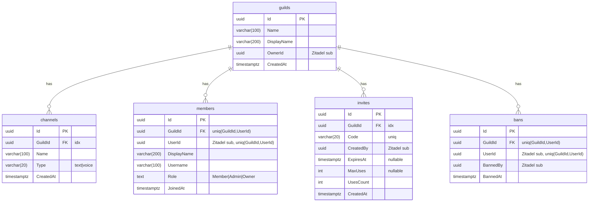
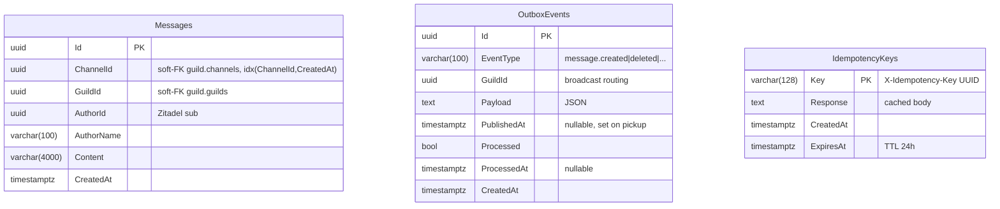
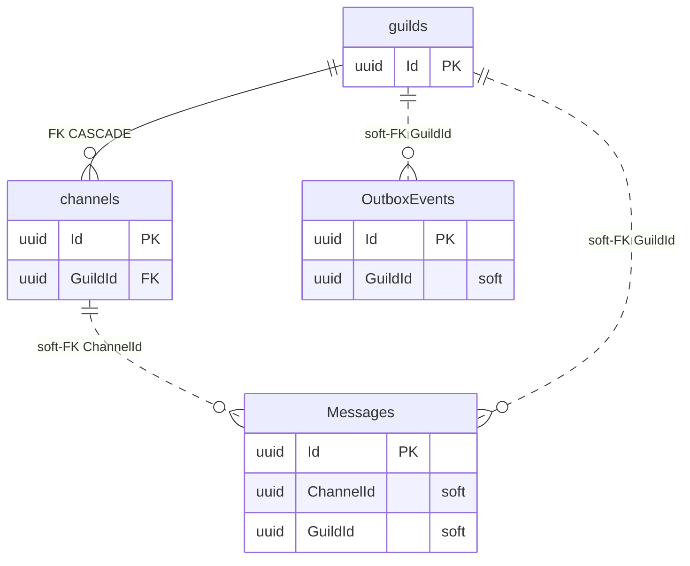

# Реляционная схема

Карта таблиц, полей и связей между ними для бизнес-БД `nextalk`.
БД Zitadel (`zitadel`) управляется самим Identity Provider и в этот документ не входит.

> Источник истины - EF Core миграции:
> - [guild-service/.../Migrations/20260515235625_Initial.cs](../src/guild-service/NexTalk.Guild.Service/Infrastructure/Migrations/20260515235625_Initial.cs)
> - [messaging-service/.../Migrations/20260516124606_InitialCreate.cs](../src/messaging-service/NexTalk.Messaging.Service/Migrations/20260516124606_InitialCreate.cs)

DBML-версия для [dbdiagram.io](https://dbdiagram.io/d): [schema.dbml](schema.dbml).

---

## 1. Схемы и владельцы

| PG-схема | Сервис-владелец | Таблицы |
|:--|:--|:--|
| `guild` | Guild Service | `guilds`, `channels`, `members`, `invites`, `bans` |
| `messaging` | Messaging Service | `Messages`, `OutboxEvents`, `IdempotencyKeys` |

> Имена таблиц в `guild` - snake_case (явный `ToTable("...")` в [GuildDbContext.cs](../src/guild-service/NexTalk.Guild.Service/Infrastructure/GuildDbContext.cs)).
> Имена таблиц в `messaging` - PascalCase (EF Core по умолчанию подставляет имя `DbSet<>` свойства, явных `ToTable` нет в [MessagingDbContext.cs](../src/messaging-service/NexTalk.Messaging.Service/Infrastructure/MessagingDbContext.cs)).

## 2. Связь с Zitadel

Идентификатор пользователя из JWT-claim `sub` (UUID) хранится как обычный `uuid`-столбец без FK - Zitadel-БД физически отдельная база, кросс-БД FK невозможны.
Поля, ссылающиеся на Zitadel `sub`:

| Таблица | Поле | Семантика |
|:--|:--|:--|
| `guild.guilds` | `OwnerId` | Создатель сервера |
| `guild.members` | `UserId` | Кто состоит в гильдии |
| `guild.invites` | `CreatedBy` | Кто создал инвайт |
| `guild.bans` | `UserId`, `BannedBy` | Кого забанили / кто забанил |
| `messaging.Messages` | `AuthorId` | Автор сообщения |

`Username` и `DisplayName` дублируются в `members` намеренно - Guild Service не ходит в Zitadel для отрисовки списка участников.

---

## 3. Schema `guild`

### Таблица `guilds`

| Колонка | Тип | NULL | Default | Описание |
|:--|:--|:--:|:--|:--|
| `Id` | `uuid` | NO | - | **PK** |
| `Name` | `varchar(100)` | NO | - | Уникальное «короткое» имя (slug-like) |
| `DisplayName` | `varchar(200)` | NO | - | Отображаемое имя |
| `OwnerId` | `uuid` | NO | - | Zitadel sub создателя |
| `CreatedAt` | `timestamptz` | NO | - | Момент создания |

Индексы: только PK.

### Таблица `channels`

| Колонка | Тип | NULL | Default | Описание |
|:--|:--|:--:|:--|:--|
| `Id` | `uuid` | NO | - | **PK** |
| `GuildId` | `uuid` | NO | - | **FK → `guilds.Id`** (ON DELETE CASCADE) |
| `Name` | `varchar(100)` | NO | - | Имя канала |
| `Type` | `varchar(20)` | NO | `"text"` | `text` | `voice` |
| `CreatedAt` | `timestamptz` | NO | - | Момент создания |

Индексы:
- `IX_channels_GuildId` (`GuildId`) - для `WHERE GuildId = ?`.

### Таблица `members`

| Колонка | Тип | NULL | Default | Описание |
|:--|:--|:--:|:--|:--|
| `Id` | `uuid` | NO | - | **PK** |
| `GuildId` | `uuid` | NO | - | **FK → `guilds.Id`** (CASCADE) |
| `UserId` | `uuid` | NO | - | Zitadel sub |
| `DisplayName` | `varchar(200)` | NO | - | Отображаемое имя (snapshot) |
| `Username` | `varchar(100)` | NO | - | `preferred_username` (snapshot) |
| `Role` | `text` | NO | - | Хранится как строка enum: `Member` / `Admin` / `Owner` |
| `JoinedAt` | `timestamptz` | NO | - | Момент вступления |

Индексы:
- `IX_members_GuildId_UserId` (`GuildId`, `UserId`) **UNIQUE** - один пользователь не может состоять в одной гильдии дважды.

### Таблица `invites`

| Колонка | Тип | NULL | Default | Описание |
|:--|:--|:--:|:--|:--|
| `Id` | `uuid` | NO | - | **PK** |
| `GuildId` | `uuid` | NO | - | **FK → `guilds.Id`** (CASCADE) |
| `Code` | `varchar(20)` | NO | - | Уникальный публичный код (для `/invite/{code}`) |
| `CreatedBy` | `uuid` | NO | - | Zitadel sub автора |
| `ExpiresAt` | `timestamptz` | YES | `NULL` | TTL; `NULL` = бессрочно |
| `MaxUses` | `integer` | YES | `NULL` | Лимит использований; `NULL` = без лимита |
| `UsesCount` | `integer` | NO | - | Текущее число использований |
| `CreatedAt` | `timestamptz` | NO | - | Момент создания |

Индексы:
- `IX_invites_Code` (`Code`) **UNIQUE** - lookup по коду + защита от коллизий.
- `IX_invites_GuildId` (`GuildId`).

### Таблица `bans`

| Колонка | Тип | NULL | Default | Описание |
|:--|:--|:--:|:--|:--|
| `Id` | `uuid` | NO | - | **PK** |
| `GuildId` | `uuid` | NO | - | **FK → `guilds.Id`** (CASCADE) |
| `UserId` | `uuid` | NO | - | Zitadel sub забаненного |
| `BannedBy` | `uuid` | NO | - | Zitadel sub модератора |
| `BannedAt` | `timestamptz` | NO | - | Момент бана |

Индексы:
- `IX_bans_GuildId_UserId` (`GuildId`, `UserId`) **UNIQUE** - повторный бан того же юзера невозможен.

### ER-диаграмма (schema `guild`)

---

## 4. Schema `messaging`

### Таблица `Messages`

| Колонка | Тип | NULL | Default | Описание |
|:--|:--|:--:|:--|:--|
| `Id` | `uuid` | NO | - | **PK** |
| `ChannelId` | `uuid` | NO | - | Soft-FK → `guild.channels.Id` (без БД-FK, разные сервисы) |
| `GuildId` | `uuid` | NO | - | Soft-FK → `guild.guilds.Id` (денормализация для broadcast) |
| `AuthorId` | `uuid` | NO | - | Zitadel sub |
| `AuthorName` | `varchar(100)` | NO | - | snapshot имени (без JOIN при чтении истории) |
| `Content` | `varchar(4000)` | NO | - | Тело сообщения plain text |
| `CreatedAt` | `timestamptz` | NO | - | Момент отправки |

Индексы:
- `IX_Messages_ChannelId_CreatedAt` (`ChannelId`, `CreatedAt`) - cursor-pagination истории.

### Таблица `OutboxEvents`

| Колонка | Тип | NULL | Default | Описание |
|:--|:--|:--:|:--|:--|
| `Id` | `uuid` | NO | - | **PK** |
| `EventType` | `varchar(100)` | NO | - | Точечная нотация: `message.created`, `message.deleted`, … |
| `GuildId` | `uuid` | NO | - | Для роутинга broadcast в WS Gateway |
| `Payload` | `text` | NO | - | JSON-payload события |
| `PublishedAt` | `timestamptz` | YES | `NULL` | Помечается OutboxWorker'ом в момент pickup; защита от двойной обработки |
| `Processed` | `boolean` | NO | - | `true` после успешного broadcast |
| `ProcessedAt` | `timestamptz` | YES | `NULL` | Момент успешной доставки |
| `CreatedAt` | `timestamptz` | NO | - | Момент INSERT в одной транзакции с `Messages` |

Индексы:
- `IX_OutboxEvents_Processed_PublishedAt_CreatedAt` (`Processed`, `PublishedAt`, `CreatedAt`) - выборка необработанных событий по времени.

### Таблица `IdempotencyKeys`

| Колонка | Тип | NULL | Default | Описание |
|:--|:--|:--:|:--|:--|
| `Key` | `varchar(128)` | NO | - | **PK** (UUID из заголовка `X-Idempotency-Key`) |
| `Response` | `text` | NO | - | Сериализованный ответ; возвращается при повторном запросе |
| `CreatedAt` | `timestamptz` | NO | - | Момент первого выполнения |
| `ExpiresAt` | `timestamptz` | NO | - | TTL = 24ч; cleanup BackgroundService'ом |

Индексы: только PK.

### ER-диаграмма (schema `messaging`)

> В `messaging` нет физических FK между таблицами и нет hard-FK на `guild.*`: каждая микросервисная схема ограничена своей БД-границей. Согласованность поддерживается на уровне приложения (проверка доступа через `GET /internal/channels/{id}/access` к Guild Service).

---

## 5. Cross-schema soft-связи

Пунктир = soft-FK (без `FOREIGN KEY` на уровне Postgres, целостность поддерживается приложением).

---

## 6. Каскадные удаления

| Триггер | Что удаляется автоматически |
|:--|:--|
| `DELETE FROM guild.guilds WHERE Id = ?` | `channels`, `members`, `invites`, `bans` той же гильдии (PG CASCADE) |

Сообщения в `messaging.Messages` **не удаляются** при удалении гильдии: они в другой БД-схеме и каскад не дотягивается. Чистка - отдельная задача Messaging Service (в MVP не реализована).
