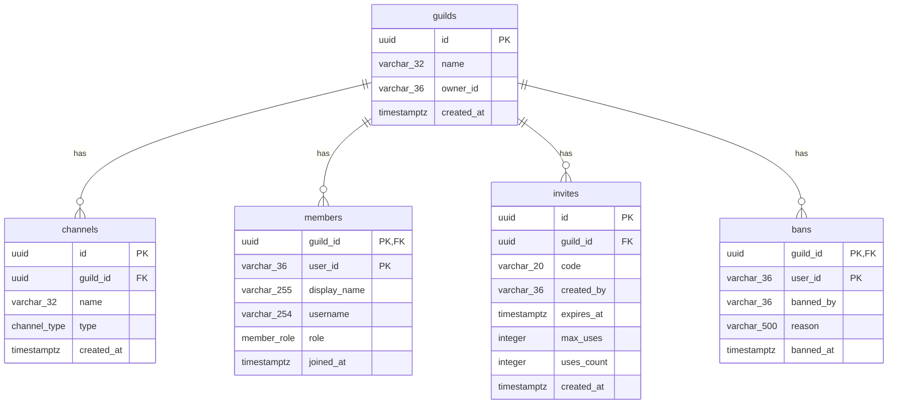
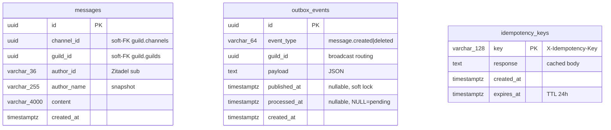

# Реляционная схема

Карта таблиц, полей и связей между ними для бизнес-БД `nextalk`.

БД Zitadel (`zitadel`) управляется самим Identity Provider и в этот документ не входит.

DBML-версия для [dbdiagram.io](https://dbdiagram.io/d): [schema.dbml](schema.dbml).

---

## 1. Схемы и владельцы

| PG-схема    | Сервис-владелец   | Таблицы                                            |
| :---------- | :---------------- | :------------------------------------------------- |
| `guild`     | Guild Service     | `guilds`, `channels`, `members`, `invites`, `bans` |
| `messaging` | Messaging Service | `messages`, `outbox_events`, `idempotency_keys`    |

## 2. Связь с Zitadel

Идентификатор пользователя - сырая строка из JWT-claim `sub` (Zitadel выдает snowflake-ID, например `"287040091499675137"`).
Поля, хранящие sub пользователя:

| Таблица              | Поле                   | Семантика                   |
| -------------------- | ---------------------- | --------------------------- |
| `guild.guilds`       | `owner_id`             | Создатель сервера           |
| `guild.members`      | `user_id`              | Кто состоит в гильдии       |
| `guild.invites`      | `created_by`           | Кто создал инвайт           |
| `guild.bans`         | `user_id`, `banned_by` | Кого забанили / Кто забанил |
| `messaging.messages` | `author_id`            | Автор сообщения             |

---

## 3. Schema `guild`

### Таблица `guilds`

| Колонка      | Тип           | NULL | Default    | Описание                                    |
| :----------- | :------------ | :--: | :--------- | :------------------------------------------ |
| `id`         | `uuid`        |  no  | `uuidv7()` | **PK**                                      |
| `name`       | `varchar(32)` |  no  | -          | Название гильдии, мин. 2 символа после trim |
| `owner_id`   | `varchar(36)` |  no  | -          | Zitadel sub создателя                       |
| `created_at` | `timestamptz` |  no  | `now()`    | Момент создания                             |

Индексы: PK на `id`, обычный на `owner_id`.

### Таблица `channels`
| Колонка      | Тип           | NULL | Default    | Описание                                |
| ------------ | ------------- | ---- | ---------- | --------------------------------------- |
| `id`         | `uuid`        | no   | `uuidv7()` | **PK**                                  |
| `guild_id`   | `uuid`        | no   | -          | **FK -> `guilds.id`** ON DELETE CASCADE |
| `name`       | `varchar(32)` | no   | -          | Имя канала, мин. 1 символ после trim    |
| `type`       | `varchar(20)` | no   | `'text'`   | ENUM: `text`, `voice`                   |
| `created_at` | `timestamptz` | no   | `now()`    | Момент создания                         |

Индексы: PK на `id`, обычный на `guild_id`.

### Таблица `members`

| Колонка        | Тип           | NULL | Default  | Описание                                    |
| :------------- | :------------ | :--: | :------- | :------------------------------------------ |
| `guild_id`     | `uuid`        |  no  | -        | **PK, FK** -> `guilds.Id` ON DELETE CASCADE |
| `user_id`      | `varchar(36)` |  no  | -        | **PK**, Zitadel sub                         |
| `display_name` | `varchar(255)` |  no  | -        | snapshot из JWT claim `name`                |
| `username`     | `varchar(254)` |  no  | -        | snapshot из JWT claim `preferred_username`  |
| `role`         | `text`        |  no  | -        | enum: `member`, `admin`, `owner`; DB default нет, значение передает приложение |
| `joined_at`    | `timestamptz` |  no  | `now`    | Момент вступления                           |

Индексы: составной PK `(guild_id, user_id)`.

### Таблица `invites`

| Колонка      | Тип           | NULL | Default    | Описание                                  |
| :----------- | :------------ | :--: | :--------- | :---------------------------------------- |
| `id`         | `uuid`        |  no  | `uuidv7()` | **PK**                                    |
| `guild_id`   | `uuid`        |  no  | -          | **FK** -> `guilds.Id` ON DELETE CASCADE   |
| `code`       | `varchar(20)` |  no  | -          | Уникальный публичный код, мин. 6 символов |
| `created_by` | `varchar(36)` |  no  | -          | Zitadel sub автора                        |
| `expires_at` | `timestamptz` | yes  | `NULL`     | TTL; `NULL` = бессрочно                   |
| `max_uses`   | `integer`     | yes  | `NULL`     | Лимит; `NULL` = без лимита                |
| `uses_count` | `integer`     |  no  | `0`        | Текущее число использований               |
| `created_at` | `timestamptz` |  no  | `now()`    | Момент создания                           |

Индексы: PK на `id`, UNIQUE на `code`, обычный на `guild_id`.

### Таблица `bans`

| Колонка     | Тип           | NULL | Default | Описание                                    |
| :---------- | :------------ | :--: | :------ | :------------------------------------------ |
| `guild_id`  | `uuid`        |  no  | -       | **PK, FK** -> `guilds.id` ON DELETE CASCADE |
| `user_id`   | `varchar(36)` |  no  | -       | **PK**, Zitadel sub забаненного             |
| `banned_by` | `varchar(36)` |  no  | -       | Zitadel sub модератора                      |
| `reason`    | `varchar(500)` | yes  | `NULL`  | Причина бана                                |
| `banned_at` | `timestamptz` |  no  | `now()` | Момент бана                                 |

Индексы: составной PK `(guild_id, user_id)`.

### ER-диаграмма (schema `guild`)

---

## 4. Schema `messaging`

### Таблица `messages`

| Колонка       | Тип             | NULL | Default    | Описание                       |
| :------------ | :-------------- | :--: | :--------- | :----------------------------- |
| `id`          | `uuid`          |  no  | `uuidv7()` | **PK**                         |
| `channel_id`  | `uuid`          |  no  | -          | Soft-FK -> `guild.channels.Id` |
| `guild_id`    | `uuid`          |  no  | -          | Soft-FK -> `guild.guilds.Id`   |
| `author_id`   | `varchar(36)`   |  no  | -          | Zitadel sub                    |
| `author_name` | `varchar(255)`  |  no  | -          | snapshot из JWT claim `name`   |
| `content`     | `varchar(4000)` |  no  | -          | Мин. 1 символ после trim       |
| `created_at`  | `timestamptz`   |  no  | `now()`    | Момент отправки                |

Индексы: PK на `id`, составной на `(channel_id, created_at)`.

### Таблица `outbox_events`

| Колонка        | Тип           | NULL | Default  | Описание                                    |
| :------------- | :------------ | :--: | :------- | :------------------------------------------ |
| `id`           | `uuid`        |  no  | `uuidv7` | **PK**                                      |
| `event_type`   | `varchar(64)` |  no  | -        | `message.created`, `message.deleted`, …     |
| `guild_id`     | `uuid`        |  no  | -        | Для роутинга broadcast                      |
| `payload`      | `text`        |  no  | -        | JSON-payload                                |
| `published_at` | `timestamptz` | yes  | `NULL`   | Soft lock; NOT NULL = in-flight или завис   |
| `processed_at` | `timestamptz` | yes  | `NULL`   | NULL = не обработано, NOT NULL = доставлено |
| `created_at`   | `timestamptz` |  no  | `now()`  | Момент INSERT                               |

Индексы: PK на `id`, partial на `(published_at, created_at)` WHERE `processed_at IS NULL`.

### Таблица `idempotency_keys`

| Колонка      | Тип            | NULL | Default | Описание                                       |
| :----------- | :------------- | :--: | :------ | :--------------------------------------------- |
| `key`        | `varchar(128)` |  no  | -       | **PK** (UUID из заголовка `X-Idempotency-Key`) |
| `response`   | `text`         |  no  | -       | Сериализованный ответ                          |
| `created_at` | `timestamptz`  |  no  | -       | Момент первого выполнения                      |
| `expires_at` | `timestamptz`  |  no  | -       | TTL = 24ч                                      |

Индексы: только PK.

### ER-диаграмма (schema `messaging`)

> В `messaging` нет физических FK между таблицами и нет hard-FK на `guild.*`: каждая микросервисная схема ограничена своей БД-границей. Согласованность поддерживается на уровне приложения (проверка доступа через `GET /internal/channels/{id}/access` к Guild Service).

---

## 5. Cross-schema soft-связи

---

### 6. Каскадные удаления

|Триггер|Что удаляется автоматически|
|:--|:--|
|`DELETE FROM guild.guilds WHERE id = ?`|`channels`, `members`, `invites`, `bans` той же гильдии (PG CASCADE)|

Сообщения в `messaging.messages` **не удаляются** при удалении гильдии: они в другой БД-схеме и каскад не дотягивается. Чистка - отдельная задача Messaging Service (в MVP не реализована).